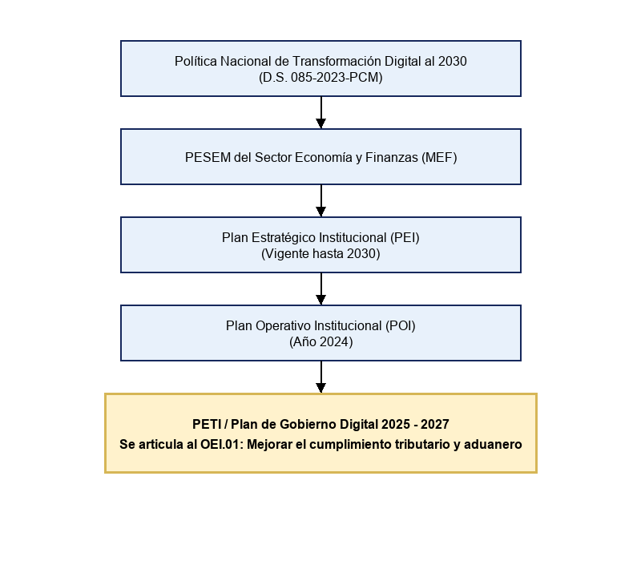

## 1.2 Marco de planeamiento y articulación de instrumentos

### 1.2.1 Instrumentos de planeamiento de la organización
A continuación se detallan los instrumentos de planeamiento vigentes para la organización objeto de estudio (SUNAT):

| Instrumento | ¿Existe? | Vigencia | ¿Está aprobado formalmente? |
|---|---|---|---|
| PESEM (Sector Economía y Finanzas) | Sí | - | Sí |
| Plan Estratégico Institucional (PEI) | Sí | 2026-2030 | Sí, Res. 000395-2025 |
| Plan Operativo Institucional (POI) | Sí | 2024 | Sí |
| Plan de Gobierno Digital (PGD) / PETI | Sí | 2025-2027 | Sí, Res. 000301-2024 |

### 1.2.2 Mapa de articulación
La jerarquía de los instrumentos de planeamiento y la posición del PETI se visualizan en el siguiente diagrama:

### 1.2.3 Objetivo superior de enganche
El presente Plan de Gobierno Digital (PETI) se articula principalmente al siguiente Objetivo Estratégico Institucional de la SUNAT:
> **OEI.01: "Mejorar el cumplimiento tributario y aduanero de los administrados"**
*(Fuente: Plan Estratégico Institucional 2026-2030 de la SUNAT, pág. 63)*

**Justificación:** Se selecciona este objetivo porque la misión central de la SUNAT es la recaudación y el control aduanero. Los 5 Objetivos de Gobierno Digital (OGD) declarados por la institución se alinean directamente a facilitar y optimizar este cumplimiento mediante servicios digitales, interoperabilidad y gestión de riesgos tecnológicos.

### 1.2.4 Enfoque estratégico de la organización
El enfoque estratégico de la SUNAT se centra fuertemente en la **Excelencia Operativa** y la **Intimidad con el Cliente (Contribuyente)**. A nivel declarativo y financiero, la institución invierte fuertemente en transformación digital (Pilar 2) para masificar la emisión electrónica, los servicios en la nube y los canales virtuales, buscando facilitar las obligaciones tributarias y reducir la evasión.
*Cláusula de exclusión:* Este plan NO abordará el diseño de políticas tributarias nacionales, ni el dimensionamiento de personal fuera del área de Tecnologías de la Información, limitándose a habilitar tecnológicamente los procesos ya definidos.

### 1.2.5 Marco normativo de planeamiento aplicable
Al ser una entidad pública, el presente plan se rige por:
- Ley de Gobierno Digital (D. Leg. 1412)
- Reglamento de la Ley de Gobierno Digital (D. S. 029-2021-PCM)
- Lineamientos para la formulación del Plan de Gobierno Digital (RSGD 005-2018-PCM/SEGDI)
- Comité de Gobierno Digital y Líder de Gobierno Digital (RM 119-2018-PCM)
- Política Nacional de Transformación Digital al 2030 (D. S. 085-2023-PCM)
- Guía para el Planeamiento Institucional del CEPLAN.

### 1.2.6 Referencia metodológica: análisis comparado
**Síntesis de lo aprendido del análisis del PEI y PGD de la SUNAT:**
El análisis demostró un plan altamente maduro con un **100% de calidad en su articulación**. Todos los Objetivos de Gobierno Digital (OGD) están vinculados a un OEI específico de forma verificable, cuentan con indicadores claros (ej. Tasa Efectiva sobre Ventas), líneas base y metas anuales proyectadas.

**Qué se replica en este plan:** Se replicará la estructura de la "Matriz de Vinculación" explícita, donde cada iniciativa tecnológica y objetivo del PGD tiene asignado un indicador de éxito medible y un presupuesto o proyecto asignado.
**Qué defecto observado se evita deliberadamente:** Se evitará la redacción de objetivos tecnológicos aislados del negocio. Todos los proyectos de TI deberán justificar obligatoriamente a qué objetivo misional de la entidad están aportando (en este caso, a la recaudación o facilitación aduanera).
